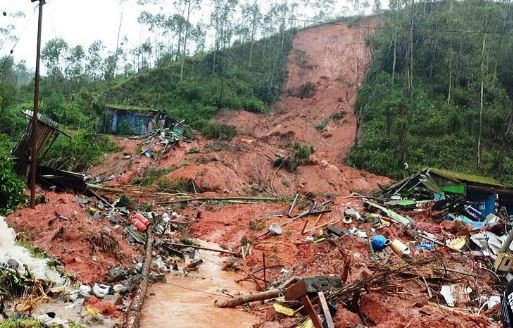
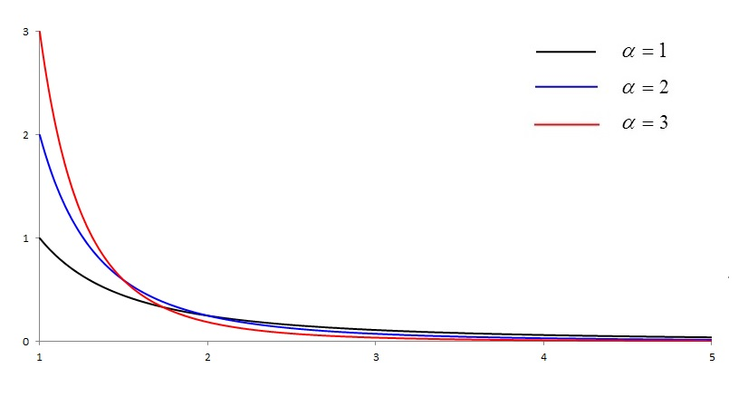
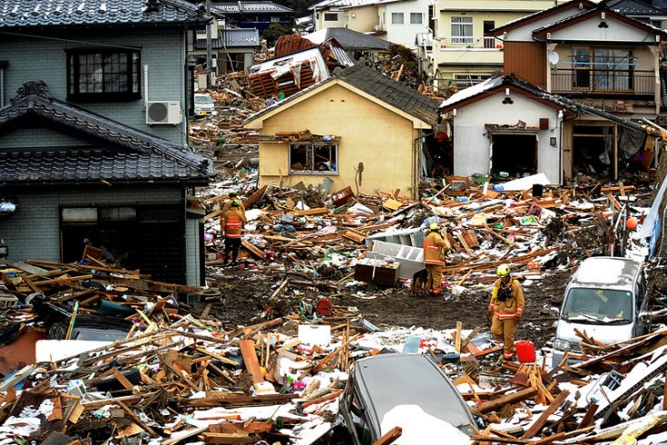

<style>
body {
text-align: justify} 
</style>

```{r setup, include=FALSE}
knitr::opts_chunk$set(echo = TRUE)
```


```{r, echo=FALSE}
htmltools::img(src = knitr::image_uri(file.path(R.home("doc"), "html", "logo.jpg")), 
               alt = 'logo', 
               style = 'position:absolute; top:0; right:0; padding:10px;')
```


<br><br>

***

## **Table of Contents**

1. [Introduction](#introduction)

2. [Bayesian Rule and its Parameters](#bayesian-rule-and-its-parameters)

3. [Review of the Application of Bayes' Rule in Hazard Assessment](#review-of-the-application-of-bayes-rule-in-hazard-assessment)

4. [Examples of Applying Bayes' Rule to Natural Hazards, Risk and Disasters](#examples-of-applying-bayes-rule-to-natural-hazards-risk-and-disasters)

    4.1 [Expectation Rates of Tropical Cyclones](#expectation-rates-of-tropical-cyclones)
  
    4.2 [Learning from Mapped Landslide Areas](#learning-from-mapped-landslide-areas)
  
    4.3 [Damages from Natural Disasters](#damages-from-natural-disasters)
  
5. [Conclusion](#conclusion)

6. [References](#references)

***


## **1. Introduction**

The cyclone Pabuk that hit Thailand, occurrence of avalanches associated with heavy snowfall in Austria, Germany and Switzerland as well as the 6.7-magnitude earthquake that struck off Coquimbo in Chile - these are only a few examples of recent natural disasters that already occurred in the first months of the year 2019 (EM-DAT, 2019)
In this context, the term **natural disaster** refers to natural events that actually happened and that affects human lives, properties and infrastructure negatively. Each natural disaster is a natural hazard. The term **natural hazard** is used when the general natural phenomenon is addressed (e.g., earthquakes, floods, landslides) (Oliver, Marion & Hill 2014: 56 f.) and it refers to the (annual) probability of a specific natural process in a given area that has an adverse impact (Jha 2010: 363). 

In the field of risk management making, these natural hazards have to be quantified in order to ensure a reasonable assessment of the risk associated with each of these hazards. Statistically, **risk** can be described as the annual expected loss from a given natural hazards in terms of financial resources. It is the product of the natural hazard (probability), vulnerability (expected loss as fraction from the total value) and elements at risk (financial losses) (Jha 2010:363 ff.). 
However, since natural hazards are naturally occurring processes, they are associated with lots of uncertainties. These uncertainties can be quantified by using a Bayesian approach (Bayes' Rule).

This report will concentrate on the underlying Bayes' Rule that serves as a basic for many quantitative analyses of natural hazards. In the following sections, the characteristics of the Bayesian approach will be explained and investigations dealing with the Bayes' Rule in the field of natural hazards will be reviewed. Moreover, three examples of the application of Bayes' Rule in the field of natural hazards will be illustrated.


## **2. Bayesian Rule and its Parameters**

For the majority of applications in scientific issues, a point estimate used in classical statistics is entirely sufficient (e.g., sample mean, standard deviation) (Bulmer 1979: 188). However, in the field of natural hazards (where you have to take sensible precaution for protection of humans life and properties), such point estimates are not sufficient enough since you have no idea about how good or bad these estimates are. That's why, a distribution of values instead of a single point value should be used in natural hazard analysis in order to consider the uncertainties.
In order to express, visualize and communicate such uncertainties, the so-called **Bayes' Rule** is often used. It was developed by the English mathematician Thomas Bayes and it is a probabilistic approach that deals with the calculation of conditional probabilities (Stone 2013: 1).  

You can think of Bayes' Rule in terms of taking an initial assumption about a hypothesis or parameter, updating this initial belief by new obtained data and thus, learning from these data (Kruschke 2010: 53 ff.). 

Mathematically, the Bayes' Rule can be described as follows (Kruschke 2010: 53 ff.):

$$P(A|B)=\frac{P(B|A)*P(A)}{P(B)}$$

, where P is the probability, A are the parameters or the things we wish to learn and B are the given or observed data.

The Bayes' Rule can also be written in words (Kruschke 2010: 57): 

$$Posterior=\frac{Likelihood*Prior}{Evidence}$$
<br><br>

It is difficult to calculate the **posterior** directly. In order to being able to work with the Bayes' Rule, the parameters **prior**, **likelihood** and **evidence** must be determined. In the following, the three parameters in focus are: prior, likelihood and posterior. 
In real life problems, a common starting point is that we have observations (given dataset). We want to analyse these data in order to learn something about the parameters of the dataset. Thus, the aim is to get an estimation of these parameters by using the given data those distribution, in turn, depends on the unknown quantities. 
In a Bayesian framework, first of all, the **prior** should be defined, which is central to a Bayesian approach (in contrast to the likelihood that is also used in classical statistics). The prior is a probability distribution, in which all possible outcomes of the things, we wish to learn about, are used, without considering the actual data. The prior belief reflects the previous knowledge (e.g., expert knowledge, previous studies) about the parameters of interest before observing the data we want to analyse. In order to obtain a probability distribution, the outcomes of the prior belief must be weighted by using a suitable distribution also based on previous knowledge (Stone 2013: 78).

After defining the prior, the observed data are taken into account by computing the **likelihood**. In a more formal way, the likelihood can be defined as the conditional probability of observing the data given specific values for the respective parameters. It is thus the inverted posterior. The likelihood, that is a function of the choice of input parameters, reconciles the prior with the actual data we have. It is a measure of how credible the data are generated given specific parameter values (Kruschke 2010: 59).

By using the likelihood, the prior is updated into the **posterior**. The posterior is a probability distribution of the values of the prior belief. It shows how probable a particular parameter value is considering the data. Thus, the posterior can be used in order to determine what we can learn about a parameter from the dataset. The only difference between the prior and the posterior is that the posterior has seeing the data (Stone 2013: 79).

## **3. Review of the Application of Bayes' Rule in Hazard Assessment**

In order to introduce the role of Bayes' Rule in natural hazards, risks and disasters, 20 studies, dealing with the application of the Bayes' Rule for different natural hazards, have been prepared. Moreover, this review helps to get a better understanding of the Bayesian parameters (prior, likelihood) in the context of the investigation of natural hazards.

**Table 1** provides an overview about the 20 studies. For each reference, the type of phenomenon studied and the choice of prior and likelihood is determined.

```{r, echo=FALSE}
tableData <- data.frame(
  number=c(
    "1","2","3","4","5","6","7","8","9","10","11","12","13","14","15","16","17","18","19","20"
  ), 
  phenomenon=c(
    "influence of ENSO and NAO on coastal hurricane activity (annual hurricane counts)", 
    "explosive volcanoes (long-term hazard assessment)",
    "occurrence of tornados",
    "number of tropical cyclone formation",
    "occurrence of rainfall-triggered landslides",
    "extreme surges and their return levels",
    "global mean temperature change",
    "regional-scale climate change (focus on surface air temperature)",
    "change points in climatic records",
    "global warming due to greenhouse gas emissions",
    "volcanic hazard assessment",
    "occurrence times and corresponding magnitudes of earthquakes",
    "pyroclastic flows and associated explosive volcanism",
    "inter-arrival time of strong earthquakes",
    "volume of a volcanic eruption",
    "explosive volcanism (short- and long-term volcanic hazard)",
    "influences on the frequency of extreme floods",
    "avalanches and their return period",
    "occurrence of tsunamis of certain intensity or run-up height",
    "subglacial hydrogeology"
  ),
   prior=c(
    "noninformation (nearly uniform) and bootstrap (informative) prior", 
    "depends on event tree node: beta, Dirichlet ",
    " normal, inverse gamma",
    "normal",
    "binomial",
    "normal",
    "uniform, gamma (uninformative)",
     "normal",
    "multivariate normal, inverse-chi-squared",
    "uniform, beta",
    "beta",
    "gamma",
    "uniform",
    "exponential ",
    "log-normal, Bernoulli",
    "uniform, beta",
    "normal",
    "uniform",
    "uniform",
    "uniform, long-normal, multivariate normal"
   ),
   likelihood=c(
    "Poisson", 
    "varies for event tree nodes: binomial, multinomial ",
    "exponential <> binomial",
    "Poisson",
    "Poisson",
    "bivariate logistic <> Poisson",
    "normal",
     "normal",
    "normal",
    "normal",
    "Poisson <> Weibull",
    "conditional log-likelihood",
    "normal",
    "Poisson",
    "log-likelihood ",
    "Bernoulli trial scheme",
    "Gumbel",
    "log-likelihood",
    "Poisson",
    "normal"
   ),
   references=c(
    "ELSNER, J.; JAGGER, T. (2004)", 
    "MARZOCCHI, W.; SANDRI, L.; FURLAN, C. (2006)",
    "CHENG, V. et al. (2013)",
    "WERNER, A.; HOLBROOK, N. (2011)",
    "BERTI, M. et al. (2012)",
    "COLES, S.; TAWN, J. (2005)",
    "LOPEZ, A. et al. (2006)",
    "MIN, S.; HENSE, A.; KWON, W. (2005)",
    "RUGGIERI, E. (2013)",
    "MEINSHAUSEN, M. et al. (2009)",
    "HO, C., SMITH, E. (1997)",
    "PERUGGIA, M.; SANTNER, T. (1996)",
    "ROSSANO, S. et al. (1996)",
    "FERRAES, S. (1985)",
    "GREEN, R. et al. (2016)",
    "MARZOCCHI, W. et al. (2004)",
    "KWON, H.; BROWN, C.; LALL, U. (2008)",
    "STRAUB, D.; GRET-REGAMEY, A. (2006) ",
    " YADAV, R. et al. (2013)",
    " BRINKERHOFF, D. et al. (2016)"
   )
)

names(tableData)<- c("Number", "Phenomenon", "Prior", "Likelihood", "References")
knitr::kable(tableData,booktabs=TRUE, caption="Table 1: Overview of Application of Bayes' Rule in Hazard Assessment")

```

<br><br>

Moreover, each of the study is briefly summarised with a focus on highlighting the way of integrating Bayes' Rule in the analysis. 

*A Hierarchical Bayesian Approach to Seasonal Hurricane Modelling*:
Elsner and Jagger (2004) use an (hierarchical) Bayesian approach in the climatological analysis of hurricanes in the U.S with less accurate historical records. The hurricane frequency, in terms of annual hurricane counts conditioned on the state of El Nino Southern Oscillation (ENSO) and North Atlantic Oscillation (NAO), is modelled. Thus, the influence of these climate factors is examined. The comparison of the posterior distributions from Bayesian models using noninformative and bootstrap priors shows, that the influence of ENSO factors on hurricane activity decreases while the effect of NAO factors enhanced slightly when using a bootstrap prior.

***

*A Quantitative Model for Volcanic Hazard Assessment*:
In order to quantify the long-term volcano hazard, Marzocchi et al. (2006) define an event tree scheme for an explosive volcano in order to evaluate the probability for several possible volcanic events. Bayesian methods are implemented in the event tree scheme. Bayes' Rule is used to estimate the probability of events at each node of the event tree. For a hypothetical volcano, they determined a probability of 0.036 that volcanic unrest occurred and an eruption as well as magmatic intrusion are detected.

***

*Probability of Tornado Occurrence across Canada*:
Cheng et al. (2013) estimate the probability of the occurrence of tornados in Canada by using a Bayesian approach. This approach is appropriate since the documented number of tornado occurrences is often biased and underreported due to varying population density (and thus, observers). The Bayesian modelling approach allows including bias in tornado observations. Analyses show, that the actual (modelled) number of tornado occurrences is at least twice the number of recorded tornados (150 and 70 $yr^{-1}$), respectively. 

***

*A Bayesian Forecast Model of Australian Region Tropical Cyclone*: 
Werner and Holbrook (2011) developed a seasonal forecast model of the tropical cyclone formation to predict the seasonal number of tropical cyclogenesis (TCG) occurrences for the Australian region. The Bayesian approach is used to estimate the best possible model coefficients. Moreover, by using a posterior probability for the coefficients, uncertainties are taken into account. With this information, they predict the probability of TCG counts for the seasons 1988/89 to 2007/08.

***

*Probabilistic rainfall thresholds for landslide occurrence using a Bayesian approach*: 
Berti et al. (2002) use a Bayesian approach to calculate the probability of rainfall-triggered landslides.  Rainfall thresholds for landslide occurrence are evaluated for the Emilia Romagna Region (Italia). In this study, Bayes' Rule was applied for different dimensions (e.g., 1D and 2D). The results show, that rainfall event parameters (duration, intensity, total rainfall) are more important for triggering landslides than antecedent rainfall. 

***

*Bayesian Modelling of Extreme Surges on the UK east coast*:
As a basis for the flood risk assessment, Coles (2005) analyses extreme surges that occur at the eastern coast of the UK. In this study, a Bayesian analysis of extreme events is performed.  Coles highlights the importance of Bayes as it allows to deal with uncertainties and allows a probabilistic representation of estimates for the surges return values. For the site Lowestoft, he predicts a probability of 0.02 that the maximum surge, that will occur in the following year, will exceed the 50-year return level (empirical estimate).

***

*Two Approaches to Quantifying Uncertainty in Global Temperature Changes*:
Lopez et al. (2005) use a Bayesian statistical model to estimate the global mean temperature change. They studied the Bayesian model from Tebaldi (Tebaldi et al., 2005) that is used to estimate uncertainty in climate model prediction and to compute the (posterior) probability distribution future temperature change. Moreover, the predictions of global temperature change of Tebaldis approach are compared to those of the ASK approach. The Bayesian probability density function for the global temperature change is much narrower for Tebaldi than the one obtained using ASK.

***

*Regional-Scale Climate Change Detection Using a Bayesian Decision Method*: 
Min, Hense and Kwon (2004) perform a Bayesian assessment of regional-scale climate change and show an application for the East Asian surface air temperature (SAT) field. The Bayesian approach is used to select the scenario with the largest posterior probability out of two possible scenarios: no-climate change and CO2-induced climate change.  For the East Asian SAT field, a CO2-induced climate change signal since 1990s is shown. However, the Bayesian climate change analysis for this study object is highly sensitive to the times scales but not very sensitive to spatial scales. 

***

*A Bayesian Approach to Detecting Change Points in Climatic Records*:
Ruggieri (2013) developed a Bayesian Change Point algorithm that is used for the identification of change points in climatic records. Compared to a frequentist approach, the Bayesian approach provides an estimation of uncertainties for the location and the number of change points. Applying this approach to NOAA/NCDC annual global surface temperature anomalies time series and much longer $\delta^{18}O$ proxy records of the Plio-Pleistocene, most likely three and seven change points are identified in the NOAA and proxy record, respectively.

***

*Greenhouse-Gas Emission Targets for Limiting Global Warming to 2 °C*:
Meinshausen et al. (2009) aim for quantify the greenhouse gas emissions for the period 2000 to 2050 that account for a global warming limit of 2 °C. They chose a Bayesian approach for modelling the climate sensitivity. Results show that the probability of exceeding 2 °C can be limited to below 25 % by $CO_2$ emission below 1000 Gt.

***


*Volcanic Hazard Assessment Incorporating Expert Knowledge: Application to the Yucca Mountain Region, Nevada, USA*: 
Ho and Smith (1997) assess the volcanic hazard (probability of at least one disruption for the next 10,000 years) for the Yucca Mountain site in Nevada by using a Bayesian approach. They focus on the comparison of different priors (mathematical, expert). Priors that are chosen for a mathematical simplicity result in uniformly higher values for the volcanic hazard compared to expert priors. 

***

*Bayesian Analysis of Time Evolution of Earthquakes*:
Peruggia and Santner (1996) use a Bayesian approach to analyse the occurrence times and magnitude of seismic events. In this context, they use occurrence times and magnitudes for seismic events of the Sannio Matese region in Italia. The research area has numerous heterogeneous seismic activities that can be easily visualized by dynamically developing the functional (e.g. median) conditional posterior intensity over time. Researchers can then determine which seismic activities exist at specific locations and thus the risk for the affected sites and their surroundings. 

***

*Computer Simulation of Pyroclastic Flow movement: An Inverse Approach*:
Rossano et al. (1996) reconstruct source parameters (vent position, flow velocity at the vent) and rheological parameters for pyroclastic flows by using a Bayesian approach. They used field data of the termini of pyroclastic flows deposits. Interestingly, by applying Bayes' Rule to single points of a specified grid, even a spatial assessment is possible. Application of this approach for the Campanian Ignimbrite (Southern Italy) yields an eruptive vent that is very probable located 10 km north of Naples and flow velocity in the range of 140-170 m/s.

***

*The Bayesian Probabilistic Prediction of Strong Earthquakes in the Hellenic Arc*:
Ferraes (1985) describes a probabilistic forecasting of earthquakes. He calculated the probability of an earthquake with a specified magnitude that is associated with a specific inter-arrival-time. Bayes' Rule is applied in order to estimate uncertainties in earthquake occurrences. The estimation of inter-arrival times for earthquakes in the Hellenic arc indicates that a strong earthquake activity can be expected between 1992 to 2002. 

***

*Estimation of Tephra Volumes from Sparse and Incompletely Observed Deposit Thicknesses*:
Green et al. (2016) calculate eruption volumes based on tephra deposits. In this context, a Bayesian approach enables the volume estimates from measured tephra deposit thicknesses that are sparse and incomplete. This contrasts strongly with other, non-Bayesian studies that have to use widespread tephra deposits resulting from large events. By using tephra measurements from the Mt Taranaki (New Zealand), a posterior mean volume between 0.002 and 0.26 $km^3$ is estimated.

***

*Quantifying Probabilities of Volcanic Events: The Example of Volcanic Hazard at Mount Vesuvius*:
In contrast to Marzocchi et al. (2006), who describe the event tree scheme in detail, Marzocchi et al (2004) provide a real-life application of this methodology for estimation of volcanic hazards at Mount Vesuvius (Italy). The advantage of the use of a prior that merges all information available (theoretical, historical, geological, monitoring) is highlighted. For a quiet period, the eruption probability at Mount Vesuvius with a Volcanic Explosivity Index greater than four is estimated to be about $3x10^{-4}$.

***

*Climate Informed Flood Frequency Analysis and Prediction in Montana Using Hierarchical Bayesian Modelling*:
Kwon, Brown and Lall (2008) use a hierarchical Bayesian Analysis to estimate climatic factors (e.g., sea surface temperature, snow pack depth) that influence the frequency of extreme floods in Montana. The Bayesian approach allows taking into account the uncertainty that is associated with each climatic parameter. Moreover, peak annual flows are analysed. For the Clark Fork River (Montana), the applied model shows a correlation between the observed and the predicted annual peak flow of 0.7 and 0.5 for the snow pack depth and sea surface temperature, respectively.

***

*A Bayesian Probabilistic Framework for Avalanche Modelling Based on Observations*:
Straub and Gret-Regamey (2006) provide a probabilistic hazard model for avalanche hazards. Since it is not possible to measure the parameters of that avalanche model directly, the models are associated with large uncertainties. For risk assessment, these uncertainties must be addressed. By using a Bayesian approach, the uncertainty of different model parameters can be estimated. 

***

*An Evaluation of Tsunami Hazard using Bayesian approach in the Indian Ocean*:
Yadav et al. (2013) calculate the Tsunami hazard in the Indian Ocean and the Andaman-Sumatra-Java region by using a Bayesian approach. Related to the calculation, is the estimation of tsunami hazard parameters (tsunami intensity, tsunami activity rate) and their uncertainties by Bayesian statistics. For the Indian Ocean, the maximum tsunami intensity and activity rate is estimated as 5.39 +-$\pm$ 0.30 and 0.08 events/year, respectively.

***

*Inversion of a glacier hydrology model*:
Brinkerhoff et al. (2016) aim at quantify the parameter values (e.g., subglacial/englacial exchange coefficient, basal traction coefficient) in a coupled subglacial and sliding models from observed surface velocity and terminal discharge. They use Bayes' Rule to estimate the probability distribution of each, unknown model parameter and thus, to find the most probable parameter values. Applying this model to the Kennicott Glacier (U.S.) shows that the ice surface velocity can be explained by the exchange of water between englacial and subglacial systems.
***

<br><br>

This **review showed** that the Bayes' Rule can be applied flexibly to a variety of different problems. There are not only various fields of application (earthquakes, volcanic eruptions, floods, storms, tsunamis, mass movements, climate-change) but also different processes and parameters about which the authors would like to learn something. These are estimates **of physical sizes and time sequences as well as spatial assessment**. Due to the variety of fields of applications, no preference in the choice of prior and likelihood can be seen. Furthermore, the 20 studies showed that the consideration of the uncertainty of parameters is one of the most important advantages of Bayes' Rule. **two main properties that make it different from other statistical methods - incorporating statistical uncertainty associated with the estimation of parameters and prior". 


## **4. Examples of Applying Bayes' Rule to Natural Hazards, Risk and Disasters**

In order to illustrate the procedure of applying the Bayes' Rule and show possibilities, three examples of how to apply Bayes' Rule to natural hazards, risks and disasters are presented. Different (probability) distributions are used for the prior and likelihood in order to show the various options in Bayesian analysis. For each example, the underlying R code is included. 

### 4.1 Expectation Rates of Tropical Cyclones

<style>
div.blue { background-color:#e6f0ff; border-radius: 5px; padding: 20px;}
</style>
<div class = "blue">

*In the past few years, there is an increasing number of studies focusing on tropical cyclones and whether they will increase in frequency and strength over the course of time. In this context, meteorologist Irma is interested in the expectation rate of tropical cyclones for an isolate island in the Indian Ocean that has not yet been properly researched. She obtained a dataset that shows the number of tropical cyclones in the Indian Ocean around this island per year. In order to get a better assessment of the hazard associated with cyclones, she wishes to learn about the cyclone rates that are most probable.*

</div>
<br><br>


<br><br>
In order to estimate the most probable annual rate of cyclones from the dataset, we use a **Poisson distribution** for the occurrence of cyclones (likelihood). A Poisson distribution should be chosen whenever one is interested in the calculation of the event rates from a dataset that contains the number of counts of these events in a fixed time interval. In general, the Poisson distribution is a discrete probability distribution that shows the probability of a given number of events in a specified interval (also known as expectation rate), assuming that these events are independent (Manning & Schuetze 1999: 545).
The Bayes' Rule for Irma's problem looks as follows:
$$p(\lambda|D)=\frac{p(D|\lambda) p(\lambda)}{p(D)}$$
with:

*D = Irma's data  
*$\lambda$ = annual expectation rate of tropical cyclones


**Data Basis**

The data (counts of tropical cyclones per year) that Irma obtained for the years 2008 to 2018 can be represented by the following vector:


```{r}
# number of cyclones per year over the last 10 years
cyclones <- c(9, 13, 8, 3, 10, 6, 13, 15, 16, 14)
```

The values in this and the following examples are fictitious and not based on scientific investigations.

**Specify Prior Belief and Define Prior Probability**

First of all, all possible outcomes for the annual number of tropical cyclones that could have been occurred are defined based on our previous knowledge. The lower limit of our prior assumption is set to 0 cyclones per year since years without tropical cyclones are possible. Based on a previous study - [The Global Climatology of Tropical Cyclones](http://oxfordre.com/naturalhazardscience/view/10.1093/acrefore/9780199389407.001.0001/acrefore-9780199389407-e-79) - the upper limit is set to 80 cyclones per year. Therefore, we define a vector that contains integers from 0 to 80, that represents the number of cyclones per year. 

```{r}
# define all possible outcomes for the expectation rate
prior <- seq(from = 0, to = 80, by = 1) 
```


We assume that Irma has no information about which of the cyclone rates is more probable. Thus, a discrete **uniform probability distribution** is used to give the same weight to all these possible outcomes for the cyclone rates. This results in equally probable cyclone rates. The prior probability, described before, is easily calculated by assigning each outcome the reciprocal of the total number of outcomes.

```{r}
# create uniformly distributed cyclone rates
prior_prob <- rep(1/length(prior),times = length(prior)) 

```

The prior probability looks as follows: 

```{r, fig.cap = "Figure 2: Prior probability distribution of annual cyclone rates.", fig.align="center", echo=FALSE}

# plot the discrete uniform probability distribution

plot(prior, prior_prob, 
     type="h", 
     main = "Prior probability distribution of annual cyclone rates", 
     xlab ="Annual rate of tropical cyclones", 
     ylab = "Prior probability", 
     lwd = 2,
     col="dodgerblue3")
grid()
```

<br><br>
**Calculate the Likelihood**

In the following step, the likelihood (probability of the observed annual cyclone counts given the prior-defined expectation rates) is calculated. As mentioned above, we use a Poisson distribution as best description of the problem of cyclone events. Since all cyclone events are independent of each other, the likelihood can be calculated by multiplying several Poisson distributions. For each distribution, Irma's dataset is the fixed input variable but the used event rate $\lambda$ differs. Here, each value of the prior assumption (about expectation rate), specified above, is used.

```{r}
# create a vector with the same number of entries as in "prior" as storage for calculated products
likeli <- rep(NA,length(prior))

# using a loop for the calculation of the likelihood
# Poisson distribution: use of dpois with cyclones as input variable and prior belief (ourcomes) as rate parameter


for (i in seq_along(prior))
{
  likeli[i] <- prod(dpois(cyclones,lambda=prior[i]))
}

```

```{r, fig.cap = "Figure 3: Calculated likelihood for the annual cyclone rate.", fig.align="center", echo=FALSE}
# plot the likelihood

plot(prior, likeli,
     type ="h", 
     main = "Likelihood", 
     xlab ="Annual number of tropical cyclones", 
     ylab = "Likelihood", 
     lwd = 2,
     col="dodgerblue3")
grid()
```
<br><br>

**Calculate the Posterior**

The calculated probability distribution for the prior and the likelihood function are used to update the prior probability to the posterior probability of cyclone expectation rates. It is necessary to multiply the likelihood with the prior probability. Instead of dividing the result by the evidence, as stated in Bayes' Rule, we use the renormalization approach. The product of prior and likelihood is divided by the sum of all possible outcomes.

```{r}
# calculate the posterior
bayes_rate <- likeli * prior_prob
bayes_rate <- bayes_rate/ sum(bayes_rate)

# which(c(bayes_rate) == max (bayes_rate))
```

```{r, fig.cap = "Figure 4: Posterior probability distribution of annual cyclone rates.", fig.align="center", echo=FALSE}
# plot the posterior probability distribution
plot(prior, bayes_rate, 
     type = "h", 
     main = "Posterior probability distribution of annual cyclone rates", 
     xlab ="Annual number of tropical cyclones", 
     ylab = "Posterior probability", 
     lwd = 2,
     col="dodgerblue3")
grid()

# plot a vertical line for most probable rate 
abline(v = 11, lty = 2, lwd = 2, col = "firebrick3")

legend(57, 0.35, legend = c("most probable rate"),
      col = c("firebrick3"), lty = 2, lwd = 1, cex = 0.8)
```
<br><br>

Due to the chosen uniformly distributed prior, the posterior probability distribution looks like the likelihood function (Poisson distribution). As shown in Figure 4, 11 tropical cyclones are most probable for the island given the data Irma obtained. Compared to the point estimates (mean of the cyclone dataset is 10.7), we can see now, that the cyclone rates are unsymmetrically distributed around the outcome with the highest probability. Slightly lower cyclone rates are more probable than higher rates. Such a comparison of different outcomes cannot be made when using a point estimate!

In this example, the posterior cyclone rate distribution could be adjusted by learning from new knowledge. Irma could find out, that tropical cyclones rates are exponentially distributed with lower rates being more probable than higher rates. By using a Bayesian approach, we can learn from new experiences and Irma can easily change the prior probability distribution to obtain newer and probably also better results. At the same time, however, this illustrates also a disadvantage of the Bayesian approach: Our final results are in many cases only as good as the chosen prior. 


### 4.2 Learning from Mapped Landslide Areas

<style>
div.blue { background-color:#e6f0ff; border-radius: 5px; padding: 20px;}
</style>
<div class = "blue">

*During a field trip and by using remote sensing, geologist Thomas identified past landslides for a mountain range in China and estimated the area of each individual landslide. He is now interested in how the landslide areas are distributed in order determine which range of minimum areas are most probable to result from future landslides. * 

</div>

<br><br>

<div style="display:flex; align-content:flex-start;flex-wrap:wrap;">
 


<span style="width:42%;display:inline-flex;">Figure 5:  Su Village (Sucun) landslide in Zhejiang Province, China (Ouyang et al., 2019)</span>
<span style="width:56%;display:inline-flex;padding-left: 10px;">Figure 6:  Pareto probability distribution function, with fixed scale parameter and varying shape parameters (boost.org)</span6
</div>


<br><br>


We choose a **Pareto distribution** in order to learn something about the size distribution of landslide areas, as shown by **Stark (2002)**. A Pareto distribution can be applied to problems where a variable follows a power-law with a small range of values that have a comparable high probability. The distribution can be described by the shape parameter (or Pareto's Index) $\alpha$ and the scale parameter $\theta$. The shape parameter defines the ratio of the probability of smaller values to that of larger values - the larger $\alpha$ the smaller is the proportion of very high values. The scale parameter is the minimum value of the variable under consideration and it defines also the maximum of the Pareto distribution **(Tiwari & Zalkikar, 1990)**. 

According to Stark (2002), values for the landslide area come from a Pareto distribution with the shape parameter $\alpha = 3/2$. You can think about this distribution as a model to describe landslide areas.  Since $\alpha$ is already fixed in the Pareto distribution, we have to estimate the shape parameter and quantify its uncertainties in order to work with this model and to help Thomas.


**Data Basis**

Data of landslide areas [in $m^2$] obtained by Thomas are:

```{r}
#create a vector of mapped landslide areas [in m²]
area <- c(600, 70, 240, 120, 60, 340,80, 180, 450, 90, 60, 130, 140, 200)
```

**Specify Prior Belief and Define Prior Probability**

For our prior belief, we have to specify to what extent lower landslide areas are more probable than higher landslide areas. This is done by defining the shape parameter (Pareto Index) that is unknown for our landslide area distribution. 
By using previous studies, we assume, that a Pareto Index between 0.5 and 2.5 is possible:

```{r}
#prior knowledge about Pareto index 
#create a vector with values from alpha = 0.5 to alpha = 2.5 to illustrate our prior knowledge

prior <- seq(from = 0.5, to = 2.5, by = 0.01)
```

Moreover, we know that lots of landslide data show a Pareto distribution of $\alpha = 3/2$, as reported by Stark (2002). **We also found out that lower and higher Pareto Indices are less probable and that the probability decreases with increasing distance from $\alpha = 3/2$**. In order to account for this knowledge, a **normal distribution** is used for weighting the specified Pareto Indices. The mean $\mu$ is set to 1.5 since this Pareto Index should have the highest probability. Furthermore, the standard deviation $\sigma=0.2$ is chosen in order to create a narrow curve. Since we create with `dnorm` a probability density for the normal distribution, we have to renormalize the result to obtain the prior probability distribution for the specified Pareto Indices. Figure 7 shows the prior probability. 

```{r}
#create a normally distributed prior with a mean of 1.5 and a standard deviation of 0.2

prior_prob <- dnorm(prior, mean = 1.5, sd = 0.2)

#renormalisation to obtain a true probability distribution

prior_prob <- prior_prob/sum(prior_prob)
```


```{r, fig.cap = "Figure 7: Prior probability distribution of the Pareto Indix.", fig.align="center", echo=FALSE}
# plot the normal probability distribution

plot(prior, prior_prob, 
     type="h", 
     main = "Prior probability distribution of the Pareto Index", 
     xlab ="Pareto Index", 
     ylab = "Prior probability", 
     lwd = 2,
     col="darkseagreen")
grid()
```
<br><br>

**Calculate the Likelihood**

With Thomas' landslide dataset and the outcomes of the prior belief about the Pareto Index, we can compute the likelihood (see Fig. 8). Due to the assumed independence of landslide occurrences, we can calculate the likelihood by multiplying the Pareto distributions. In each distribution, the data of Thomas' investigation and the scale parameter (minimum landslide area of the dataset) are fixed. For the $i^{th}$ factor of the product the $i^{th}$ Pareto Index of our prior belief is used. 

*Note: Maybe it is necessary to install the package `VGAM` in order to work with the function `dpareto`.*


```{r}
#Package VGAM is required for applying the dpareto function
#uncomment if necessary:
#install.packages("VGAM")

library(VGAM)

#create a vector with the same number of entries as in "prior"
likeli <- rep(NA, length(prior))

#likelihood as product of Pareto distributions (dpareto), with fixed scale parameter and varying shape parameter
for (i in seq_along(prior)) {
 likeli[i] <- prod(dpareto(area, scale=min(area), shape=prior[i]))
}

```

```{r, fig.cap = "Figure 8: Likelihood for the investigated problem.", fig.align="center", echo=FALSE}
#plot the likelihood

plot(prior, likeli,
     type ="h", 
     main = "Likelihood", 
     xlab ="Pareto Index", 
     ylab = "Likelihood", 
     lwd = 2,
     col="darkseagreen")
grid()

```
<br><br>

**Calculate the Posterior**

The posterior probability for our problem is calculated by applying the Bayes' Rule: The likelihood is multiplied by the prior probability and then renormalized to obtain the posterior probability. 

```{r}
#renormalise the product of likelihood and prior to calculate posterior 
posterior <- likeli*prior_prob
posterior <- posterior/sum(posterior)

#find most probable Pareto Index
#prior[which.max(posterior)]
```

```{r, fig.cap = "Figure 9: Posterior probability distribution of Pareto Index.", fig.align="center", echo=FALSE}
#plot the posterior probability distribution

plot(prior, posterior, 
     type = "h", 
     main = "Posterior probability distribution", 
     xlab ="Pareto Index", 
     ylab = "Posterior probability", 
     lwd = 2,
     col="darkseagreen")
grid()

#find most probable Pareto Index
#prior[which.max(posterior)]

#plot a vertical line for most probable Index 
abline(v = 1.39, lty = 2, lwd = 2, col = "firebrick3")
legend(57, 0.2, legend = c("most probable rate"),
      col = c("firebrick3"), lty = 2, lwd = 1, cex = 0.8)
```
<br><br>

The resulting estimation of the posterior probability of the Pareto Index for Thomas' landslide distribution is shown in Figure 9. A Pareto Index of 1.39 is most probable to describe the distribution of Thomas' landslide area data. 
That's why, we can now create a Pareto distribution with the landslide area as input variable and a shape parameter of 1.39. Figure 10, indicates, that lower landslide areas area more probable than higher landslide areas. For the mountain range investigated by Thomas, the occurrence of landslides smaller than 100 $m^2$ is more likely than the occurrence of landslides with greater areas.

```{r, fig.cap = "Figure 10: Pareto probability distribution of landslide areas", fig.align="center"}
landslides <- dpareto(area, scale=min(area), shape= 1.39)
landslides <- landslides/sum(landslides)

plot(area, landslides, 
     type = "h", 
     main = "Pareto probability distribution for Thomas' landslide data", 
     xlab ="Landslide area [m²]", 
     ylab = "Probability", 
     lwd = 2)
grid()

```
<br><br>

In this example, it was shown how Bayes' Rule can be used to estimate an unknown model parameter. Compared to other methods, our results are a distribution of values so that we can deal with uncertainties. 

### 4.3 Damages from Natural Disasters

<style>
div.blue { background-color:#e6f0ff; border-radius: 5px; padding: 20px;}
</style>
<div class = "blue">

*Bayes-Town was hit by several natural disasters since it is situated at a coast in the tropics, at a steep hillside and near an active fault. In recent years, the inhabitants are more and more concerned and ask themselves: Which natural hazard is the most dangerous one particularly with regard to causing major damage?*

</div>

<br><br>





<br><br>

In this context, we compare the damage potential of three natural hazards (earthquakes, rockfalls, floods). In order to solving this problem, a **binomial distribution** is chosen to **estimate the success probability (the probability of the occurrence of a certain number of natural disasters with major damages relative to the total number of natural disaster)** (binomial likelihood).

The binomial distributions can be used for problems that can only take two outcomes (often, success and failure). The number of a specific outcomes can be counted for a prespecified number of trials n with a constant probability p for an occurring success. The success probability describes the number of **successes (outcomes with a success) ** divided by the total number of **occurrences/outcomes of a phenomenon**. The binomial distribution describes the probability **that a phenomenon has the outcome A (or success) for a specified number of times in n trials of this phenomenon** (Fletscher 2017: 42 ff.).
In our case, the phenomenon are natural disasters with two outcomes: no damage (equivalent to failure) and major damage (equivalent to success). We are now interested in the "major-damage"-outcomes. 

**Data Basis**

A list with the number of major damages, resulting from natural disasters, per year for Bayes-Town serves as the basis for the analysis. In this context, major damage refers to a monetary damage greater than a prespecified threshold.

We assume, that we gathered a broad range of values for the count of natural disasters with a major damage. That's why we create vectors that contain counts of total damages per year (resulting from earthquakes, rockfalls and floods, respectively) sorted by number of total damages in ascending order. 


```{r}
#number of damages (successful outcomes) for earthquakes, rockfalls and floods
EQ <- seq(from = 10, to = 50, by = 1)
rockfall <- seq(from = 0, to = 10, by = 1)
flood <- seq(from = 0, to = 30, by = 1)
```

**Specify Prior Belief and Define Prior Probability**


The prior represents probability distribution of possible values for the success probability p. As stated above, this is the ratio of the number of major damages to total number of natural disasters. Therefore, it values between 0 and 1 must be assigned to p. 

We assume, that p can have outcomes in the range from 0 to 1 (for earthquakes, floods, rockfalls):

```{r}
#Prior belief on p 

#Create p-values from 0 to 1 in 0.01 steps
prior_EQ <- seq(from = 0, to = 1, by = 0.001)
prior_rock <- seq(from = 0, to = 1, by = 0.001)
prior_flood <- seq(from = 0, to = 1, by = 0.001)
```

Since the possible outcomes for p range from 0 to 1, we choose a **beta distribution** for p. In order to assign probabilities to the possible outcomes of p, we have to specify the parameters $\alpha$ and $\beta$ of the distribution.

* Earthquakes: High $\alpha$ and low $\beta$ values are chosen in order to express our belief of a high success probability
* Rockfalls: In order to more strongly weight lower values of p, we select high $\beta$ and low $\alpha$ values
* Floods: We express uncertainty of p-values, by using similar $\alpha$ and $\beta$ values
```{r}
#create a beta distribution for prior belief values

#alpha=20, beta=5
prior_prob_EQ <- dbeta (prior_EQ, 20, 5)
prior_prob_EQ <- prior_prob_EQ/sum(prior_prob_EQ)

#alpha=3, beta=17
prior_prob_rock <- dbeta (prior_rock, 3, 17)
prior_prob_rock <- prior_prob_rock/sum(prior_prob_rock)

#alpha=55, beta=50
prior_prob_flood <- dbeta (prior_flood, 55, 50)
prior_prob_flood <- prior_prob_flood/sum(prior_prob_flood)
```

```{r, fig.cap = "Figure 12: Prior probability distribution of the major damage (success) probability p for earthquakes (blue), rockfalls (green) and floods (orange).", fig.align="center", fig.width = 10, fig.height=9, out.width = "1000px", echo=FALSE}
par(mfrow = c(3,1))
plot(prior_EQ,prior_prob_EQ, type = "h", xlab = "Major damage probability", ylab = "Prior probability", lwd = 2, col="skyblue3", cex.lab = 1.5)
grid()

plot(prior_rock,prior_prob_rock, type = "h", xlab = "Major damage probability", ylab = "Prior probability", lwd = 2, col="seagreen3", cex.lab = 1.5)
grid()

plot(prior_flood,prior_prob_flood, type = "h", xlab = "Major damage probability", ylab = "Prior probability", lwd = 2, col="darkorange3", cex.lab = 1.5)
grid()
```
<br><br>

**Calculate the Likelihood**

As stated above, we sample from a binomial distribution for the earthquake, rockfall and flood data. As in the previous examples, we calculate the likelihood by multiplying binomial distributions due to the assumed independence of events. The created data of the number of major damages are the input variable for the `dbinom` function. The number of trials is set to 100. The success probability changes with the respective prior belief that is used. 

```{r}
#likelihood: earthquakes
likeli_EQ <- rep(NA, length(prior_EQ))
for (i in seq_along(prior_EQ)) {
 likeli_EQ[i] <- prod(dbinom(EQ, size = 100, prob = prior_EQ[i])) 
}

#likelihood: rockfalls
likeli_rock <- rep(NA, length(prior_rock))
for (i in seq_along(prior_rock)) {
 likeli_rock[i] <- prod(dbinom(rockfall, size = 100, prob = prior_rock[i])) 
}

#likelihood: floods
likeli_flood <- rep(NA, length(prior_flood))
for (i in seq_along(prior_flood)) {
 likeli_flood[i] <- prod(dbinom(flood, size = 100, prob = prior_flood[i])) 
}
```

```{r, fig.cap = "Figure 13: Likelihood for the investigated problem by using the earthquake (blue), rockfall (green) and flood (orange) dataset, respectively.", fig.align="center", fig.width = 10, fig.height=9, out.width = "1000px", echo=FALSE}

par(mfrow = c(3,1))
plot(prior_EQ, likeli_EQ, type="h",xlab = "Major damage probability", ylab = "Likelihood", lwd = 2, col="skyblue3", cex.lab = 1.5)
grid()
plot(prior_rock, likeli_rock, type="h", xlab = "Major damage probability", ylab = "Likelihood", lwd = 2, col="seagreen3", cex.lab = 1.5)
grid()
plot(prior_flood, likeli_flood, type="h", xlab = "Major damage probability", ylab = "Likelihood", lwd = 2, col="darkorange3", cex.lab = 1.5)
grid()

```
<br><br>

**Calculate the Posterior**

Now we use Bayes' Rule to obtain the posterior probability by updating the binomial likelihood function with the beta-distributed prior for all the three natural hazards: 

```{r}
#posterior: earthquakes
posterior_EQ <- likeli_EQ*prior_prob_EQ
posterior_EQ <- posterior_EQ/sum(posterior_EQ)

#posterior: rockfalls
posterior_rock <- likeli_rock*prior_prob_rock
posterior_rock <- posterior_rock/sum(posterior_rock)

#posterior: floods
posterior_flood <- likeli_flood*prior_prob_flood
posterior_flood <- posterior_flood/sum(posterior_flood)

```

```{r, echo=FALSE}
max_EQ <- prior_EQ[which.max(posterior_EQ)]
max_rock <- prior_rock[which.max(posterior_rock)]
max_flood <- prior_flood[which.max(posterior_flood)]
```


```{r, fig.cap = "Figure 14: Posterior probability distribution of the major damage (success) probability p for earthquakes (blue), rockfalls (green) and floods (orange).", fig.align="center", fig.width = 10, fig.height=9, out.width = "1000px", echo=FALSE}

par(mfrow = c(3,1))
plot(prior_EQ, posterior_EQ, type="h", xlab = "Major damage probability", ylab = "Posterior probability", lwd = 2, col="skyblue3", cex.lab = 1.5)
legend(0.85, 0.05, legend = c("most probable p"),
      col = c("firebrick3"), lty = 2, lwd = 1, cex = 0.8)
abline(v = max_EQ, lty = 2, lwd = 2, col = "firebrick3")
grid()
plot(prior_rock, posterior_rock, type="h", xlab = "Major damage probability", ylab = "Posterior probability", lwd = 2, col="seagreen3", cex.lab = 1.5)
abline(v = max_rock, lty = 2, lwd = 2, col = "firebrick3")
grid()
plot(prior_flood, posterior_flood, type="h", xlab = "Major damage probability", ylab = "Posterior probability", lwd = 2, col="darkorange3", cex.lab = 1.5)
abline(v = max_flood, lty = 2, lwd = 2, col = "firebrick3")
grid()
```
<br><br>

The calculated probability distributions in Figure 14 show that the estimated maximum posterior probability for the success probability is 0.30 for earthquakes, 0.05 for rockfalls and 0.16 for floods, respectively. Due to this estimation, we can conclude that, most probable, earthquakes are the most dangerous natural hazard with regard to causing major damages. Whereas, the inhabitants of should not be concerned about major damaging due to rockfalls. 


## **5. Conclusion**

This report deals with the fields of application of the Bayes' Rule in connection with natural hazards. 

In the first section, therefore, the basics for the calculation and procedure are first explained. To make this clearer, 20 selected papers were analyzed and the most important parameters for the application of the Bayes' Rule were determined. Subsequently, self-selected examples were created. These serve once again for a better understanding and comprehensibility of the Bayesian approach.

With the help of this report, we were able to better determine probabilities and quantify uncertainties. This method is the focus of numerous papers in order to better analyze and predict specific natural hazards.

It can generally be said that the Bayesian Approach is a fundermentary approach to statistical calculation with a focus on natural hazards. For example, as the prediction of specific natural hazards is a sensitive issue, it is important not only to determine the mean of past events. That's why the Bayes' Rule also works with a natural interpretation of statistical confidence. Furthermore, the confidence statements of observed data depend. In addition, the Bayesian Rule focuses primarily on the interpretation of parameters, such as likelihood or even prior. The most important point to mention here is that the Bayesian approach offers an automatic method of updating probabilities (Albert 1995: 13).

Of course, these just mentioned advantages are also critical points. Of course, the interpretation of the parameters is in the focus, but it must be noted that numerous parameters can also cause errors. Finally, the calculations are based on the determination of specific parameters. If these are then determined, uncertainties occur which should then be taken into account in the new calculations for the subsequent parameter. The successive computing steps require a certain amount of complexity. In addition, the facts could be questioned in a comprehensible way.

## **6. References**

ALBERT, Jim, 1995. *Teaching Inference about Proportions Using Bayes and Discrete Models*. Journal of Statistics Education [last access: 15.02.2019]. DOI: 10.1080/10691898.1995.11910494 

BERTI, M. et al. 2012. *Probabilistic rainfall thresholds for landslide occurrence using a Bayesian approach*. Journal of Geophysical Research: Earth Surface, 117. Jg., Nr. F4.

BULMER, Michael, G, 1979. *Principles of Statistics. 1. edition*. Chelmsford (Massachusetts): Courier Corporation . ISBN 978-0-486-63760-0 

CENTRE FOR RESEARCH ON THE EPIDEMIOLOGY OF DISASTERS - CRED, 2009. EM-DAT: *The international distaster database* [online]. Centre for Research on the Epidemiology of Disasters - CRED, [last access: 05.02.2019]. available on: [EM-DAT](https://www.emdat.be/)

CHENG, Vincent YS, et al. 2013. *Probability of tornado occurrence across Canada*. Journal of Climate, 26. Jg., Nr. 23, S. 9415-9428.

COLES, Stuart; TAWN, Jonathan., 2005. *Bayesian modelling of extreme surges on the UK east coast*. Philosophical Transactions of the Royal Society of London A: Mathematical, Physical and Engineering Sciences, 363. Jg., Nr. 1831, S. 1387-1406.

ELSNER, James B., JAGGER, Thomas H., 2004. *A  hierarchical Bayesian approach to seasonal hurricane modeling*. Journal of Climate, 17. Jg., Nr. 14, S. 2813-2827.

FERRAES, Sergio G., 1985. *The Bayesian probabilistic prediction of strong earthquakes in the Hellenic arc*. Tectonophysics, 111. Jg., Nr. 3-4, S. 339-354.

FLETSCHER, Steven, J. 2017. Data Assimilation for the Geosciences: From Theory to Application. 1. edition. Amsterdam: Elsevier. ISBN 978-0-128-04484-1 

GREEN, Rebecca M., et al., 2016. *Estimation of tephra volumes from sparse and incompletely observed deposit thicknesses*. Bulletin of Volcanology, 78. Jg., Nr. 4, S. 25.

HO, Chih-Hsiang, SMITH, Eugene I., 1997. *Volcanic hazard assessment incorporating expert knowledge: application to the Yucca Mountain region, Nevada, USA*. Mathematical geology, 29. Jg., Nr. 5, S. 615-627.

International Journal of Climatology, 2013. *Bayesian approach to detecting change points in climatic records*. 33. Jg., Nr. 2, S. 520-528.

JHA, Abhas K., 2010. *Safer Homes, Stronger Communities: A Handbook for Reconstructing after Natural Disasters*. 1. edition. Washington DC: World Bank Publications. ISBN 978-0-821-38268-4 

KRUSCHKE, John, 2010. *Doing Bayesian Data Analysis: A Tutorial Introduction with R*. 1. edition. Oxford: Academic Press. ISBN 978-0-123-81486-9 

LOPEZ, Ana, et al. 2006. *Two approaches to quantifying uncertainty in global temperature changes*. Journal of Climate, 19. Jg., Nr. 19, S. 4785-4796.

MADDOCK, John et al. 2006. *Pareto Distribution* [online]. Boost C++ Libraries [last access: 10.02.2019]. available on: [boost.org](https://live.boost.org/doc/libs/1_39_0/libs/math/doc/sf_and_dist/html/math_toolkit/dist/dist_ref/dists/pareto.html)
 

MANNING, Christopher D. & SCHÜTZE, Hinrich, 1999. *Foundations of Statistical Natural Language Processing*. 1. edition. London: MIT Press . ISBN  978-0-262-13360-9 

MARZOCCHI, W.; SANDRI, L.; FURLAN, C., 2006. *A quantitative model for volcanic hazard assessment*.

MEINSHAUSEN, Malte, et al., 2009. *Greenhouse-gas emission targets for limiting global warming to 2 °C*. Nature, 458. Jg., Nr. 7242, S. 1158.

MIN, Seung-Ki; HENSE, Andreas; KWON, Won-Tae, 2005.* Regional-scale climate change detection using a Bayesian decision method*. Geophysical research letters, 32. Jg., Nr. 3.

OLIVER, Willard M., MARION, Nancy E. und HILL, Joshua B., 2014. *Introduction to Homeland Security: Policy, Organization, and Administration*. 1. edition. Burlington (Massachusetts): Jones & Bartlett. ISBN 978-1-449-64545-8 

PERUGGIA, Mario; SANTNER, Thomas., 1996. *Bayesian analysis of time evolution of earthquakes*. Journal of the American Statistical Association, 91. Jg., Nr. 435, S. 1209-1218.

RAHMSTORF, Stefan et al., 2018. *Are tropical cyclones getting wetter and stronger?* [online]. Climate and Capitalism, [last access: 15.02.2019]. available on: [www.climateandcapitalism.com](https://climateandcapitalism.com/2018/05/30/are-tropical-cyclones-getting-wetter-and-stronger/)

ROSSANO, S., et al., 1996. *Computer simulation of pyroclastic flow movement: an inverse approach*. Geophysical research letters, 23. Jg., Nr. 25, S. 3779-3782.

STARK, Colin, P. 2002. *A simple theory of landslide failure and size distribution. In prep. for submission to Nature*. Lamont-Doherty Earth Observatory of Columbia University.

STONE, James V., 2013. *Bayes' Rule: A Tutorial Introduction to Bayesian Analysis*. 1. edition. Oxford: Sebtel Press. ISBN 978-0-956-37284-0 

TIWARI, Ram C., ZALKIKAR, Jyoti N., 1990. *Empirical Bayes estimation of the scale parameter in a Pareto distribution*. Computational Statistics & Data Analysis 10. Jg., Nr. 3, S. 261-270.

UNITED STATES AGENCY FOR INTERNATIONAL DEVELOPMENT - USAID, 1961. *USAID/OFDA's Approach to Disaster Risk Reduction* [online]. United States Agency For International Development - USAID, [last access: 14.02.2019]. available on: [www.usaid.gov](https://www.usaid.gov/what-we-do/working-crises-and-conflict/disaster-risk-reduction/usaidofda-disaster-risk-reduction)

WERNER, Angelika; HOLBROOK, Neil J., 2011. A. *Bayesian forecast model of Australian region tropical cyclone formation*. Journal of Climate,  24. Jg., Nr. 23, S. 6114-6131.


&nbsp;
<hr />
<p style="text-align: center;">A work by Gwendolin Luedtke and Sina Spors </p>
<p style="text-align: center;"><span style="color: #808080;"><em>gluedtke@uni-potsdam.de sspors@uni-potsdam.de</em></span></p>

&nbsp;
