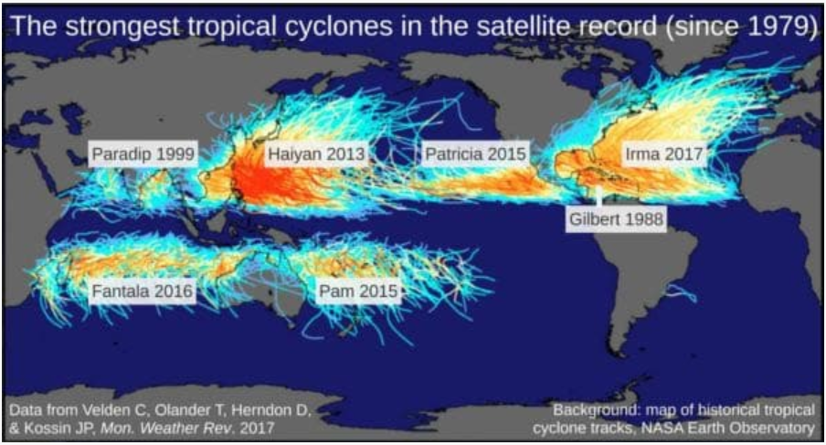

<style>
body {
text-align: justify} 
</style>

```{r setup, include=FALSE}
knitr::opts_chunk$set(echo = TRUE)
```

## Table of Contents

* [1. Introduction](#Introduction)
* [2. Bayesian Rule and its Parameters](#Bayesian-Rule-and-its-Parameters)
* [3. Review of Application of Bayes’ Rule in Hazard Assessment](#Review-of-Application-of-Bayes’-Rule-in-Hazard-Assessment)
* [4. Examples of applying Bayes’ Rule to Natural Hazards, Risk and Disasters](#Examples-of-applying_Bayes’-Rule-to-Natural-Hazards,-Risk-and-Disasters)
    * [4.1. Expectations Rates of Tropical Cycles](#Expectations-Rates-of-Tropical-Cycles)
    * [4.2. Landslide Volumes](#Landslide-Volumes)
    * [4.3. example 3](#example-3)
* [5. Conclusion](#Conclusion)
* [6. References](#References)


## **1. Introduction**

The cyclone Pabuk that hit Thailand, occurrence of avalanches associated with heavy snowfall in Austria, Germany and Switzerland as well as the 6.7-magnitude earthquake that struck off Coquimbo in Chile – these are only a few examples of recent natural disasters that already occurred in the first months of the year 2019 (EM-DAT, 2019)

In this context, the term *natural disaster* refers to natural events that actually happened and that affects human lives, properties and infrastructure negatively. Each natural disaster is a *natural hazard*. The term *natural hazard* is used when the general natural phenomenon is addressed (e.g., earthquakes, floods, landslides) (Oliver, Marion & Hill 2014: 56 f.) and it refers to the (annual = probability of a specific natural process in a given area that has an adverse impact (Jha 2010:363). 

In the field of risk management making, these natural hazards have to be quantified in order to ensure a reasonable assessment of the risk associated with each of these hazards. Statistically, *risk* can be described as the annual expected loss from a given natural hazards in terms of financial resources. It is the product of the natural hazard (probability), vulnerability (expected loss as fraction from the total value) and elements at risk (financial losses) (Jha 2010:363 ff.). 

However, since natural hazards are naturally occurring processes, they are associated with lots of uncertainties. These uncertainties can be quantified by using a Bayesian approach.

This report will concentrate on the (the Bayesian approach) underlying Bayes’ Rule (as a basic for quantitative analysis of natural hazards).

In the following sections, the characteristics of the Bayesian approach will be  explained and investigations dealing with the Bayes’ Rule in the field of natural hazards will be reviewed. Moreover, application of Bayes’ Rule in the field of natural hazards will be illustrated by three [own] examples using R. (Three examples are provided)

## **2. Bayesian Rule and its Parameters**

For the majority of applications in scientific issues, a point estimate used in classical statistics is entirely sufficient (e.g., sample mean, standard deviation) (Bulmer 1979: 188). 
However, in the field of natural hazards (where  you have to take sensible precaution for protection of humans live and properties), such point estimates are not sufficient enough since you have no idea about how good or bad these estimates are. That’s why, a distribution of values instead of a single point value should be used (in natural hazard analysis) in order to consider the uncertainties.

In order to “express, visualize and communicate such uncertainties, the so-called “Bayes’ Rule” is often used.

It was developed by the English mathematician Thomas Bayes and it is a probabilistic approach that deals with the calculation of conditional probabilities (Stone 2013: 1).  [!!!! Spezifizieren: Wass sol kalkuliert werden?].

You can think of Bayes’ Rule in terms of taking an initial assumption (belief, knowledge) about a hypothesis, updating the initial assumption (belief, knowledge) by new obtained data (observations) and thus, learning from these data (Kruschke 2010: 53). 
Mathematically, the Bayes’ Rule can be described as follows (Kruschke 2010: 53 ff.):

$$P(A|B)=\frac{P(B|A)*P(A)}{P(B)}$$

,where P is the probability, A are the parameters or the things we wish to learn and B are the given data (that we observed).

The Bayes’ Rule can also be written in words (Kruschke 2010: 57):  

$$Posterior=\frac{Likelihood*Prior}{Evidence}$$


It is difficult to calculate the *posterior* or conditional probability P(A|B) directly. An advantage of the Bayes’ Rule is that the parameters *prior* and *likelihood* can be (more easily) determined. To conclude, in order to work practically with the Bayes’ Rule, the parameters stated above must be determined.  The three parameters in focus are: prior, likelihood and posterior. 

A common starting point in real-life problems (of hazard assessment) is, that we have observations (given dataset) that we want to analyse in order to learn something from these data or the parameters of the dataset. Thus, the aim is to get an estimation of the parameters by using the data that “distribution depends on these unknown quantities” [image] (Depending on what we want to learn changes the way, how we see the data). 

In a Bayesian framework, first of all, the *prior* should be defined, which is central to Bayesian (In contrast, likelihood is also used in classical statistics). The prior is a probability distribution, in which all possible outcomes of the things, we wish to learn about, are used, without considering the actual data. The prior belief reflects the previous knowledge about the respective parameters (e.g., expert knowledge, previous studies) before observing the data we want to analyse. In order to obtain a probability distribution, the outcomes of the prior assumption/bleief must be weighted by using a suitable distribution also based on previous knowledge (Stone 2013: 78).

After defining the prior, the observed data are taken into account by computing the 
*likelihood*. In a more formal way, the likelihood can be defined as the conditional probability of observing the data given specific values for the respective parameters. The likelihood, that is a function of the choice of input parameters, is thus the inverted posterior. It is a measure of how likely it is to create the observed data (how credible data is generated) given specific parameter values or (likelihood reconcile the prior with actual data we have) (Kruschke 2010: 59).

By using the likelihood, the prior is updated into the posterior. Formally, the posterior is a probability distribution and the probability of the parameters given the observed data (how likely is a particular value of a parameter considering the data). The posterior can then be used in order to determine what we can learn about a parameter from the dataset. The only difference between the prior and the posterior is that the posterior has seeing the data (Stone 2013: 79).

## **3. Review of Application of Bayes’ Rule in Hazard Assessment**

In the following section, 20 studies of different kinds of natural hazards are summarised and used as an introduction to the role of Bayes’ Rule in natural hazards, risks and disasters. 

In order to introduce the role of Bayes’ Rule in natural hazards, risks and disasters, 20 (self-selected) studies (dealing with applying the Bayes’ Rule for different natural studies) have been prepared. Moreover, this helps to get a better understanding of this Bayesian parameters (prior and likelihood) in the context of the investigation of natural hazards.

Table XXX provides an overview about the 20 (selected) studies and studied type of phenomenon.


For each reference, the type of phenomenon studied and the choice of prior and likelihood is determined.

```{r, echo=FALSE}
tableData <- data.frame(
  number=c(
    "1","2","3","4","5","6","7","8","9","10","11","12","13","14","15","16","17","18","19","20"
  ), 
  phenomenon=c(
    "influence of effects of ENSO and NAO on coastal hurricane activity (annual hurricane counts)", 
    "(Long-term hazard assessment for) Explosive volcanoes and destructive volcanic events",
    "occurrence of tornados",
    "Tropical cyclone formation, especially the seasonal number of TCG occurrences",
    "Occurrence of landslides",
    "Oceanographic flood events after extreme flooding",
    "(global) mean temperature change",
    "regional-scale climate change (Focus on surface air temperature)",
    "Change points in climatic records",
    "Global warming due to greenhouse gas emissions",
    "statistical modeling in volcanic hazard assessment for the Yucca Mountain site",
    "occurrence times of seismic events and their corresponding magnitudes",
    "Pyroclastic flows and their movements of explosive volcanism",
    "estimate of the occurrence times for strong earthquakes in the Hellenic Arc",
    "Volcanic hazard analysis - volume of eruption",
    "16",
    "17",
    "18",
    "19",
    "20"
  ),
   prior=c(
    "a)noninformation (nearly uniform) prior b) bootstrap (informative) prior", 
    "different prior distributions for different even tree node -node 1: beta distribution -node 2: beta distribution -node 3: beta distribution -node 4: direchlet distribution",
    "Noninformative prior for model parameters, normal distribution and inverse gamma distribution",
    "normal distribution",
    "Binomial distribution",
    "range of non-informative priors",
    "uninformative, uniform and gamma",
     "Normal distribution of detection variables",
    "multivariate normal",
    "uniform",
    "beta prior",
    "Use of functional and numerical prior: gamma distributions",
    "unit probability density in that range of values",
    "exponential probability density function ",
    "lognormal  distribution",
    "16",
    "17",
    "18",
    "19",
    "20"
   ),
   likelihood=c(
    "Poisson", 
    "Likelihood varies for different even tree nodes, for node 1 in general binomial distribution, node 2 binomial distribution, node 3 binomial distribution, node 4 multinomial distribution",
    "exponential expression <> binomial",
    "Poisson",
    "Poisson",
    "bivariate logistic distribution",
    "normal distribution",
     "Gaussian distribution",
    "X² (Chi-squared)",
    "Gaussian",
    "Poisson",
    "conditional log-likelihood function",
    " for each model-build the assumed gaussian probability function",
    "Poisson",
    "log-likelihood function",
    "16",
    "17",
    "18",
    "19",
    "20"
   ),
   references=c(
    "ELSNER, James B.; JAGGER, Thomas H.", 
    "MARZOCCHI, W.; SANDRI, L.; FURLAN, C.",
    "CHENG, Vincent YS, et al.",
    "WERNER, Angelika; HOLBROOK, Neil J.",
    "BERTI, M. et al.",
    "COLES, Stuart; TAWN, Jonathan.",
    "LOPEZ, Ana, et al.",
    "MIN, Seung‐Ki; HENSE, Andreas; KWON, Won‐Tae.",
    "RUGGIERI, Eric. A",
    "MEINSHAUSEN, Malte, et al.",
    "HO, Chih-Hsiang, SMITH, Eugene I.",
    "PERUGGIA, Mario; SANTNER, Thomas.",
    "ROSSANO, S., et al.",
    "FERRAES, Sergio G.",
    "GREEN, Rebecca M., et al",
    "16",
    "17",
    "18",
    "19",
    "20"
   )
)

names(tableData)<- c("Number", "Phenomenon", "Prior", "Likelihood", "References")
knitr::kable(tableData,booktabs=TRUE, caption="Tab. 1: Review of Application of Bayes’ Rule in Hazard Assessment")

```


Moreover, each of the study is briefly summarised to highlight a *few important things of the papers*. 


*A Hierarchical Bayesian Approach to Seasonal Hurricane Modelling*:
Elsner and Jagger (2004) use an (hierarchical) Bayesian approach in the climatological analysis of hurricanes in the U.S with less accurate historical records. The hurricane frequency, in terms of annual hurricane counts conditioned on the state of El Niño –Southern Oscillation (ENSO) and North Atlantic Oscillation (NAO), is modelled. Thus, the influence of these climate factors is examined. The comparison of the posterior distributions from Bayesian models using noninformative and bootstrap priors shows, that the influence of ENSO factors on hurricane activity decreases while the effect of NAO factors enhanced slightly when using a bootstrap prior.

*A quantitative model for volcanic hazard assessment*:
In order to quantify the long-term volcano hazard, Marzocchi et al. (2006) define an event tree scheme for an explosive volcano in order to evaluate the probability for several possible volcanic events. Bayesian methods are implemented in the event tree scheme. Bayes’ Rule is used to estimate the (posterior) probability of events at each node of the event tree. For a hypothetical volcano, they determined a probability of 0,036 for the volcanic event, that unrest occurred, an eruption is detected and magmatic intrusion occurred.  

*Probability of Tornado Occurrence across Canada*
Cheng et al. (2013) estimate the probability of the occurrence of tornados in Canada by using a Bayesian approach. This approach is appropriate since the documented number of tornado occurrences is often biased and underreported due to varying population density (and thus, observers). The Bayesian modelling approach is allows the “consideration of bias in tornado observations”. Analysis shows, that the actual (modelled) number of tornado occurrences is at least twice the number of recorded tornados (150 and 70 yr^-1), respectively. 

*A Bayesian Forecast Model of Australian Region Tropical Cyclone*: 
Werner and Holbrook (2011) developed a seasonal forecast model of the tropical cyclone formation to predict the seasonal number of tropical cyclogenesis (TCG) occurrences for the Australian region. The Bayesian approach is used to estimate the (best possible) model coefficients and by using a posterior probability for the coefficient’s uncertainties (in model parameters) are taken into account. With this information, they predict the probability of TCG counts/number / seasonal number of TCG occurrences for the seasons 1988/89 to 2007/08.

*Probabilistic rainfall thresholds for landslide occurrence using a Bayesian approach*: Berti et al. (2002) use a Bayesian approach to calculate the probability of rainfall-triggered landslides.  Rainfall thresholds for landslide occurence are evaluated for the Emilia Romagna Region (Italia) based Bayesian probability. In this study, Bayes’ Rule was applied for different dimensions (1D and 2D case, multiple rain gauges). The results show, that rainfall event parameters (duration, intensity, total rainfall) are more important than antecedent rainfall for landslides. 

*Bayesian modelling of extreme surges onthe UK east coast*
..........

*Two Approaches to Quantifying Uncertainty in Global Temperature Changes*:
Lopez et al. (2005) use a Bayesian statistical model to estimate the global mean temperature change. They studied the Bayesian model from Tebaldi (Tebaldi et al., 2005) that is used to estimate uncertainty in climate model prediction and to compute the probability distribution (posterior distribution) of future temperature change ΔT (since “probabilistic projections of future climate are strongly dependent on the used approach”). Moreover, the predictions of global temperature change of the Tebaldis approach is compared to the ASK approach. The Bayesian probability density function for the global temperature change is much narrower than the one obtained using ASK.

*Regional-scale climate change detection using a Bayesian decision method*: 
Min, Hense and Kwon (2004) perform a Bayesian assessment of regional-scale climate change and “show an application for the East Asian surface air temperature (SAT) field”. The Bayesian approach is used two select the scenario with the largest posterior probability out of two possible scenarios: no-climate change and CO2-induced climate change.  For the East Asian SAT field, a CO2-induced climate change signal since 1990s is shown. However, the Bayesian climate change analysis for this “study object” is highly sensitive to the times scales but not very sensitive to spatial scales. 

*A Bayesian approach to detecting change points in climatic records*:
Ruggieri (2013) developed a Bayesian Change Point algorithm that is used for the identification of change points in climatic records, but more important the Bayesian approach to the change point problem provides a estimation of uncertainties (location and number of change points) [compared to other methods/frequentist approaches which return a single value]. Applying this approach to NOAA/NCDC annual global surface temperature anomalies time series and much longer δ^18^O proxy records of the Plio-Pleistocene, most likely three and seven change points are identified in the NOAA record and proxy record, respectively.

*Greenhouse-gas emission targets for limiting global warming to 26 °C*:
Meinshausen et al. (2009) aimed for quantify the greenhouse gas emissions for the period 2000 to 2050 that for a global warming limit of 26 °C. They chose a Bayesian approach for climate sensitivity. The “probability of exceeding 26 °C can be limited to below 25 % by CO<sub>2</sub> emission below 1000 [Einheit].

*Volcanic Hazard Assessment Incorporating Expert Knowledge: Application to the Yucca Mountain Region, Nevada, USA*: Ho and Smith deal with the statistical modeling in volcanic hazard assessment for the Yucca Mountain site. Fundamentally, estimated risk values are significantly higher than those determined based on expert-driven priorities.

*Bayesian Analysis of Time Evolution of Earthquakes*:
..........

*Computer simulation of pyroclastic flow movement: An inverse approach*:
.............

*The Bayesian probabilistic prediction of strong earthquakes in the hellenic Arc*:

*Estimation of tephra volumes from sparse and incompletelyobserved deposit thicknesses*:
.....................


In this simple exercise, it becomes clear that the prior can assume different distributions. But for the introduction into the chosen topic, this serves for a better understanding. 

## **4. Examples of applying Bayes’ Rule to Natural Hazards, Risk and Disasters**

In order to understand the procedure of applying the Bayes’ Rule and the associated possibilities, three examples of how to apply Bayes’ Rule to natural hazards (risks and disasters) are presented. Different probability distributions are used in order to show the various options in Bayesian analysis. 

In the following samples, also the choose of different probability distributions is illustrated.

### 4.1 Expectations Rates of Tropical Cycles

*In the past few years, there is an increasing number of studies focusing on tropical cyclones and whether they will increase in frequency and strength over the course of time. In this context, meteorologist Irma is interested in the expectation rate of tropical cyclone for an (isolated) island in the Indian Ocean that has not yet been properly researched (but it should be built on hotels). She obtained a dataset, which shows the number of tropical cyclones in the Indian Ocean around this island per year. In order to get a better assessment of the hazard associated with cyclones, she wish to learn about the probability of cyclone rates. If too much danger is taken by a tropical cyclone, no hotels should be built. Meteorologist Irma is consecrated for this reason.*



In order to calculate the most probable (annual) rate of cyclones from the dataset, we use a Poisson distribution (Poisson distribution for likelihood – to describe the general problem – occurrence of cycones) in combination with the Bayes’ Rule. The Poisson distributions should be chosen whenever one is interested in the calculation of event rates from a dataset that contains the number of counts of these events in a fixed time interval. 

The Poisson distribution is a discrete probability distribution that shows the probability of a given number of events in a specified interval (also known as expectation rate), assuming that these events are independent (Manning & Schütze 1999: 545).

The Bayes’ Rule for Irma’s problem looks as follows:

$$p(\lambda|D)=\frac{p(D|\lambda) p(\lambda)}{p(D)}$$


with:
 
* D = data = dataset of Irma 
  
* $\lambda$ = parameter = expectation rate

Vector *cyclones* represents the data (counts of cyclones per year) Irma obtained for the years 2008 to 2018 (The values in this example are fictitious and not based on scientific investigations). 


```{r}
cyclones <- c(9, 13, 8, 3, 10, 6, 13, 15, 16, 14)
# dataset: number of cyclones per year over the last 10 years
```

**Definition of Prior**

First of all, all possible outcomes for the annual number of tropical cyclones that could have been occurred are defined based on our previous knowledge. The lower limit of our prior assumption is set to 0 cyclones per year since years without tropical cyclones are possible. Based on previous studies:

[The Global Climatology of Tropical Cyclones](http://oxfordre.com/naturalhazardscience/view/10.1093/acrefore/9780199389407.001.0001/acrefore-9780199389407-e-79), 

The upper limit is set to 80 cyclones per year. Therefore, we define a vector with 0 to 79 entries, to ensure a variable with at least 80 values for the expectation rate (entries). 

```{r}
prior <- 0:79 # define 80 values
# all possible outcomes for the expectation rate
```

We assume that Irma has no information about which expectation rate is more probable. Thus, the chosen values for the expectation rate are all equally probable and a discrete uniform probability distribution is used to give a weight to these outcomes. This prior probability looks as follows:


```{r}
prior_prob <- rep(1/length(prior),times = length(prior)) 

# plot the discrete uniform probability distribution
plot(prior_prob, type="h", 
     main = "Prior", 
     xlab ="Annual rate of tropical cyclones", 
     ylab = "Probability of occurring a tropical cyclone [%]", 
     lwd = 2)
```


**Definition of Likelihood**

In the following step, the likelihood (probability of obtained cyclone counts per year given the prior-defined values for the expectation rate) is calculated. As mentioned above, we assume a Poisson distribution as best description of the problem (we choose a Poisson distribution to describe the observed data). Since all cyclone events are independent of each other, the likelihood can be calculated by multiplying several Poisson distributions. For each distribution, Irma’s dataset is the input variable x (data is fixed) but the used mean $\lambda$ differs. Here, each value of the prior assumption (about expectation rate), specified above, are used. 


```{r}
#p(D|lambda) = Likelihood
#create a vector with the same number of entries as in "prior"
likeli <- rep(NA,length(prior))

#using a loop for the calculation
for (i in seq_along(prior))
{
  likeli[i] <- prod(dpois(cyclones,i))
}

plot(likeli,type ="h", 
     main = "Likelihood", 
     xlab ="Annual number of tropical cyclones", 
     ylab = "Likelihood [%]", 
     lwd = 2)
```

**Calculating the Posterior**

The calculated probability distribution for the prior and the likelihood function are used to update the prior probability to the posterior probability of cyclone expectations rates. It is necessary to multiply the likelihood with the prior probability. Instead of dividing the result by the evidence, as stated in Bayes’ Rule, we use the renormalization approach. The product of prior and likelihood is divided by the sum of all possible outcomes.

```{r}
# Posterior
bayes_rate <- likeli * prior_prob
bayes_rate <- bayes_rate/ sum(bayes_rate)

plot(bayes_rate, type = "h", 
     main = "Posterior", 
     xlab ="Annual number of tropical cyclones", 
     ylab = "Posterior [%]", 
     lwd = 2)
abline(v = 11, lty = 2, lwd = 2, col = "red")
legend(57, 0.2, legend = c("most probable rate"),
       col = c("red"), lty = 2, lwd = 1, cex = 0.8)
which(c(bayes_rate) == max (bayes_rate))
```

Due to the chosen uniformly distributed prior, the posterior probability distribution looks like the likelihood function (Poisson distribution).

As shown in Figure XXX, 11 tropical cyclones are most probable for the island (given the dataset). Compared to the point estimates (mean of the dataset is XXX), we can see now, that the expectations rates are unsymmetrically distributed around the highes probability with slightly lower cyclones rates are more probable than higher expectations rates. Such statements (comparison of different outcomes) cannot be made when using a point estimate!   

Moreover, Irma was interested in the probability of the occurrence of cyclone rates greater than XXX. To solve this problem, we have to integrate the posterior distribution in the limits from xxx (lower limit) to infinite (upper limit).

[code]

Integration results in a probability of xxx % to observe at least xxx tropical cyclones per year on the island. 

In this example, the calculation of the posterior probability could be approved by learning from new knowledge. Irma could find out, that tropical cyclones, more specifically the cyclones rates, are exponentially distributed with lower rates being more probable than higher rates. By using a Bayesian approach we can learn from new experiences and  Irma can easily change the prior probability distribution to obtain newer and (more probable) better results. 

However, this example shows also a disadvantage of Bayes’: Normally, uninformed priors should be avoided. 

### 4.2 Landslide Volumes 

*For a mountain range in China,geologist Thomas identified past landslides and the landslide area by XXX (identification of landslide area by using remote sensing) / geomorphologist mapped landslides.*

[bild1]
[bild2]

He is now interested in the maximum and the general distribution of landslide areas.

For this example, we choose a *Pareto distribution* – this idea is based on [Landslide rupture and the probability distribution of
mobilized debris volumes (C. P. Stark and F. Guzzetti)](https://agupubs.onlinelibrary.wiley.com/doi/pdf/10.1029/2008JF001008)

- analyses of landslide inventories, such as the example shown in Figures 1 and 2, indicate that landslide areas and volumes have frequency distributions and PDFs (probability density functions) that are heavy tailed for medium to large events. The functional form of this slow (algebraic) PDF

- such heaviness, whether precisely power law or not, means that large landslide failures are relatively far more frequent than would be the case if the tail decay were exponential (e.g., Gamma) or faster than exponential (e.g., Gaussian)

- for a power-law-tailed probability distribution, the heaviness is quantified by a scaling exponent representing the algebraic rate of decay. Here we use a for the asymptotic scaling, defined in terms of the Pareto distribution (Appendix), of the landslide area distribution, which can be written as a PDF

- pA ð Þ Aa1; ð1Þ where the symbol ‘‘’’ means ‘‘scales with,’’ in this case for large A. [8] We use b to denote the tail scaling exponent of the volume PDF

- p(A)  proportional zu A ^(- alpha -1)

- A: <100 to 10^6^ m

**Data Basis** 

Data for landslide areas obtained by Thomas are:

[zufallszahlen?]

**Definition of Prior**

The prior belief about the area of landslides is specified by using other studies that deals with landslide areas in region with a similar structure and geology and climatic setting of investigates Chinese mountain range (again, chosen values are fictious). 

Based on other studies with a similar setting, lowest landslide area is set to 10 m² and highest landslide area is set to 10^3^ m² (values are fictious). 

Due to previous studies (?), we also know that lower landslides are more common than larger landslides – therefore, an exponential distribution is used for weighting (bessere Erklärung). We also know, that the rate parameter $\lambda$ = 0.5 is sutiable for describing xxx (?). 

Phrasen siehe Übung: Moreover, we can integrate an additional constraint on the the prior since we know that Thomas is 90 % sure, that landslide area in China is between 0 and zero xxx????  (ist additional constraint hier sinnvol?)

Additional constraint on prior: zu 95 % sicher, dass XXX

We have to take into account an additional constraint on the prior. The rate $\lambda$ of an exponential distribution that gives us a prior with 90/95 % < XXX m² should be calculated. The area under the curve P(x) (probability density function of exponential distribution) represents the probability p. Therefore, an integral calculation must be made and the equation has to be resolved to $\lambda$. The lower and upper integration limits are represented by a (0) and b (5), respectively.

[Understanding rexp function in R to draw samples from exponential distribution
](https://stats.stackexchange.com/questions/234725/understanding-rexp-function-in-r-to-draw-samples-from-exponential-distribution)

......

**Definition of Likelihood**

With data and prior for landslide areas (see above), we can compute the likelihood of having the observed landslide areas, data, given the different prior values ???). For the likelihood we assume a Pareto distribution for landslide areas as described before (andere Formulierung?).

Aus R: 
The Pareto distribution is a continuous power-law density distribution with scale (a) and shape (b) parameters with the form:
f(x) = ba^b^/x^b+1^

For all x >= scale, and f(x) = 0 otherwise.

The shape parameter is known as Pareto's index or tail index, and increases the decay of f(x). This distribution was originally used to describe the allocation of wealth or income among individuals in human societies. As a continuous counterpart of Zipf Law, Pareto distribution describes well many other variables that follow a power-law.

In ecology the Pareto distribution can be used to describe the distribution of abundances among species in a biological assemblage (a.k.a. biological community) or in a sample taken from such an assemblage. Though much less used than the lognormal to fit SADs, it can fit better the extremities of the empirical distributions to which the lognormal applies (Johnson et al. 1995, p.608).

Again, Likehood is caclualted by multiplying the Pareto distribution for each xxxx (mean value). 

[Advances in Geophysics](https://books.google.de/books?id=jWU2lD8h4g4C&pg=PA61&lpg=PA61&dq=pareto+distribution+for+landslides&source=bl&ots=8mLf7Y9fb4&sig=ACfU3U1Lmi45ZcbpOrZYSLOt73YtQ9D5gg&hl=de&sa=X&ved=2ahUKEwjUroyUvLvgAhXtxKYKHSlBClw4ChDoATAEegQIBhAB#v=onepage&q=pareto%20distribution%20for%20landslides&f=false)

[Size distribution of submarine landslides and its implication to tsunami hazard in Puerto Rico](https://agupubs.onlinelibrary.wiley.com/doi/full/10.1029/2006GL026125)

...........

**Definition of Posterior**

By renormalizing the product of Likelihood function and prior probability we calculate the posterior probability of XXX.

[A simple theory of landslide failure and size distribution](http://www.uvm.edu/pdodds/files/papers/others/2002/stark_avalanches.pdf)

[Advancing Culture of Living with Landslides](https://books.google.de/books?id=MXckDwAAQBAJ&pg=PA434&lpg=PA434&dq=gaussian+distributed+landslides&source=bl&ots=4eJRID59wR&sig=ACfU3U2AeRQa4fjFii9YetOj5rCKTmJ0lQ&hl=de&sa=X&ved=2ahUKEwi626TOkrvgAhVNxMQBHYhtAIoQ6AEwBHoECAEQAQ#v=onepage&q=gaussian%20distributed%20landslides&f=false)

[Landslides and Engineered Slopes](https://books.google.de/books?id=lktnDwAAQBAJ&pg=PA105&lpg=PA105&dq=gaussian+distributed+landslides&source=bl&ots=iLQScfsbqk&sig=ACfU3U0ckUCRcWj-tlbQnEC8EErJHA8hOw&hl=de&sa=X&ved=2ahUKEwi626TOkrvgAhVNxMQBHYhtAIoQ6AEwBXoECAIQAQ#v=onepage&q=gaussian%20distributed%20landslides&f=false)

[Landslide rupture and the probability distribution of
mobilized debris volumes](https://agupubs.onlinelibrary.wiley.com/doi/pdf/10.1029/2008JF001008)

### 4.3 example 3

*Bayes-Town is hit by several natural hazards since it is situated near the steep slopes of mountains, at a coast in the tropics and near an plate boundary (active) fault with volcanoes. In recent year, the townsfolk is more and more concerned and ask themselves: Which natural hazard is most likely to kill us?*

Adopted from: Where in the United States is nature most likely to kill you? 
[Popular Science](https://www.popsci.com/natural-hazard-risk)

Here, we compare three natural hazards: floods, volcanoes and earthquakes. 

The general idea of solving the problem stated above, is that we use the concept of conjugate priors, which we get to know when reviewing the 20 studies in section 3. 

*In Bayesian land*, the Beta distribution is the conjugate prior for the p-parameter of the Binomial distribution.

**Data Basis**

*Damage States* are reported as number between zero and one in the dataset. 1/14 means that there is none damage state, 3/14 means that there is an insignificant damage state, 5/14 means that there is a minor damage state and 7/14 means that there notable damagestate, 9/14 means that these is an extensive damage state, 11/14 for major damage state and 12/14 for collapse [Based on XXX].

The dataset use for this Bayesian approach contains following information about 
Observed damage state for earthquakes, volcanic eruptions and floods:

...........

**Definition of Prior**

Adopted from: [a beta distribution model is used for characterising the earthquake/volcano/flood damage state distribution](https://www.researchgate.net/publication/269824222_A_Beta_Distribution_Model_for_Characterizing_Earthquake_Damage_State_Distribution)

From this paper:

- The beta distribution is a family of two-parameter continuous probability distributions.
It is particularly suitable to model the distribution of damage because of three main characteristics:
1. The beta distribution has a finite domain, constrained between 0 and 1, used to
represent damage ranging from no-damage to collapse.

2. The beta distribution can flexibly model a broad variety of shapes, skewness,
and curtosis, as shown in Figure 1.

3. The beta distribution is fully characterized by only two shape parameters and
(or four parameters if using arbitrary bounds).
For these reasons, the beta distribution was used in ATC-13 for the development of
fragility curves and damage probability matrices (ATC 1985). However, the assumption
that the distribution of damage follows a beta distribution has not been validated with actual damage data.

- The general form of the beta distribution has four parameters, including two shape parameters and the upper and lower bounds. The standard beta distribution when bounded between zero and one has only two parameters, and is exp

- where \(\alpha\) > 0 and \(\beta\) > 0 are the shape parameters; and Bð\(\alpha\); \(\beta\)Þ is the beta function,
which is related to the gamma function as shown above. For simplicity, we use the above formulation of the beta distribution (standard beta) by normalizing the damage states from f0;7g to f0;1g


Information for the beta - distribution:

Based on other studies, the prior belief and prior probability distribution is specified. 

The prior belief captures all possible damage states, which are generally known, from 1/14 to 13/14.

A beta distribution is used since. Two shape parameters have to  be specified (entweder Paper oder eigene Werte) > We choose a Beta(4,9)


**Definition of Likelihood**

By using the Bayes’ Rule we now update our binomial likelihood with a beta prior (conjugate principle) 

[How does the beta prior affect the posterior under a binomial likelihood
](https://stats.stackexchange.com/questions/70661/how-does-the-beta-prior-affect-the-posterior-under-a-binomial-likelihood)

[BETA-BINOMIAL – BINOMIAL JOINT DISTRIBUTION OF THE SAMPLE (“LIKELIHOOD”), BETA PRIOR](https://legacy.voteview.com/pdf/Beta-Binomial.pdf)

[TO THE BASICS: BAYESIAN INFERENCE ON A BINOMIALPROPORTION](http://www.obscureanalytics.com/2012/07/04/to-the-basics-bayesian-inference-on-a-binomial-proportion/)

[The binomial distribution](https://courses.engr.illinois.edu/cs598jhm/sp2010/Slides/Lecture02HO.pdf)

[Using R for Bayesian Statistics](https://a-little-book-of-r-for-bayesian-statistics.readthedocs.io/en/latest/src/bayesianstats.html)

Hintergrund binomial likelihood > Beta distribution is der XXX Parameter in binomial distribution

Binomial distribution – prior is probability, number of observation n ist set to xxx
Beta Idee  - damage  Idee – damage durch Natural hazards (3 damages in dieser Abbildung untereinander)

## **5. Conclusion**

This report deals with the fields of application of the Bayes’ Rule in connection with natural hazards. 

In the first section, therefore, the basics for the calculation and procedure are first explained. To make this clearer, 20 selected papers were analyzed and the most important parameters for the application of the Bayes’ Rule were determined. Subsequently, self-selected examples were created. These serve once again for a better understanding and comprehensibility of the Bayesian approach.

With the help of this report, we were able to better determine probabilities and quantify uncertainties. This method is the focus of numerous papers in order to better analyze and predict specific natural hazards.

It can generally be said that the Bayesian Approach is a fundermentary approach to statistical calculation with a focus on natural hazards. For example, as the prediction of specific natural hazards is a sensitive issue, it is important not only to determine the mean of past events. That's why the Bayes’ Rule also works with a natural interpretation of statistical confidence. Furthermore, the confidence statements of observed data depend. In addition, the Bayesian Rule focuses primarily on the interpretation of parameters, such as likelihood or even prior. The most important point to mention here is that the Bayesian approach offers an automatic method of updating probabilities.

Of course, these just mentioned advantages are also critical points. Of course, the interpretation of the parameters is in the focus, but it must be noted that numerous parameters can also cause errors. Finally, the calculations are based on the determination of specific parameters. If these are then determined, uncertainties occur which should then be taken into account in the new calculations for the subsequent parameter. The successive computing steps require a certain amount of complexity. In addition, the facts could be questioned in a comprehensible way.

## **6. References**


BERTI, M. et al. 2012. Probabilistic rainfall thresholds for landslide occurrence using a Bayesian approach. Journal of Geophysical Research: Earth Surface, 117. Jg., Nr. F4.

BULMER, Michael, G, 1979. Principles of Statistics. 1. edition. Chelmsford (Massachusetts): Courier Corporation . ISBN 978-0-486-63760-0 

CENTRE FOR RESEARCH ON THE EPIDEMIOLOGY OF DISASTERS – CRED, 2009. Titel [online]. Centre for Research on the Epidemiology of Disasters – CRED, [Zugriff am 05.02.2019]. Verfügbarkeit unter: DOMAIN

CHENG, Vincent YS, et al. 2013. Probability of tornado occurrence across Canada. Journal of Climate, 26. Jg., Nr. 23, S. 9415-9428.

COLES, Stuart; TAWN, Jonathan., 2005. Bayesian modelling of extreme surges on the UK east coast. Philosophical Transactions of the Royal Society of London A: Mathematical, Physical and Engineering Sciences, 363. Jg., Nr. 1831, S. 1387-1406.

ELSNER, James B., JAGGER, Thomas H., 2004. A  hierarchical Bayesian approach to seasonal hurricane modeling. Journal of Climate, 17. Jg., Nr. 14, S. 2813-2827.

FERRAES, Sergio G., 1985. The Bayesian probabilistic prediction of strong earthquakes in the Hellenic arc. Tectonophysics, 111. Jg., Nr. 3-4, S. 339-354.

GREEN, Rebecca M., et al., 2016. Estimation of tephra volumes from sparse and incompletely observed deposit thicknesses. Bulletin of Volcanology, 78. Jg., Nr. 4, S. 25.

HO, Chih-Hsiang, SMITH, Eugene I., 1997. Volcanic hazard assessment incorporating expert knowledge: application to the Yucca Mountain region, Nevada, USA. Mathematical geology, 29. Jg., Nr. 5, S. 615-627.

International Journal of Climatology, 2013. Bayesian approach to detecting change points in climatic records. 33. Jg., Nr. 2, S. 520-528.

JHA, Abhas K., 2010. Safer Homes, Stronger Communities: A Handbook for Reconstructing after Natural Disasters. 1. edition. Washington DC: World Bank Publications. ISBN 978-0-821-38268-4 

KRUSCHKE, John, 2010. Doing Bayesian Data Analysis: A Tutorial Introduction with R. 1. edition. Oxford: Academic Press. ISBN 978-0-123-81486-9 

LOPEZ, Ana, et al. 2006. Two approaches to quantifying uncertainty in global temperature changes. Journal of Climate, 19. Jg., Nr. 19, S. 4785-4796.

MANNING, Christopher D. & SCHÜTZE, Hinrich, 1999. Foundations of Statistical Natural Language Processing. 1. edition. London: MIT Press . ISBN  978-0-262-13360-9 

MARZOCCHI, W.; SANDRI, L.; FURLAN, C., 2006. A quantitative model for volcanic hazard assessment.

MEINSHAUSEN, Malte, et al., 2009.Greenhouse-gas emission targets for limiting global warming to 2 C. Nature, 458. Jg., Nr. 7242, S. 1158.

MIN, Seung‐Ki; HENSE, Andreas; KWON, Won‐Tae, 2005. Regional‐scale climate change detection using a Bayesian decision method. Geophysical research letters, 32. Jg., Nr. 3.

OLIVER, Willard M., MARION, Nancy E. und HILL, Joshua B., 2014. Introduction to Homeland Security: Policy, Organization, and Administration. 1. edition. Burlington (Massachusetts): Jones & Bartlett. ISBN 978-1-449-64545-8 

PERUGGIA, Mario; SANTNER, Thomas., 1996. Bayesian analysis of time evolution of earthquakes. Journal of the American Statistical Association, 91. Jg., Nr. 435, S. 1209-1218.

RAHMSTORF, Stefan et al., 2018. Are tropical cyclones getting wetter and stronger? [online]. Climate and Capitalism, [Zugriff am 15.02.2019]. Verfügbar unter: [www.climateandcapitalism.com](https://climateandcapitalism.com/2018/05/30/are-tropical-cyclones-getting-wetter-and-stronger/)

ROSSANO, S., et al., 1996. Computer simulation of pyroclastic flow movement: an inverse approach. Geophysical research letters, 23. Jg., Nr. 25, S. 3779-3782.

STONE, James V., 2013. Bayes' Rule: A Tutorial Introduction to Bayesian Analysis. 1. edition. Oxford: Sebtel Press. ISBN 978-0-956-37284-0 

WERNER, Angelika; HOLBROOK, Neil J., 2011. A. Bayesian forecast model of Australian region tropical cyclone formation. Journal of Climate,  24. Jg., Nr. 23, S. 6114-6131.


